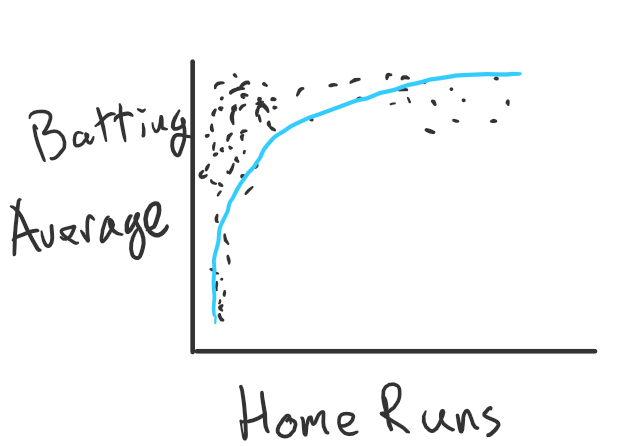

# Final Project

Original Visualization: http://bl.ocks.org/dpipkin/59b59509a2badb3ee8df9102fb97207f

Final Visualization: http://bl.ocks.org/dpipkin/166dc36b027668237baea3d2ed36dc48

## Summary

Batting Average and Home Runs are two statistics used to measure a baseball player's performance. By plotting the baseball data provided by Udacity, we can see that they are strongly related to each other. This indicates that if one is a good measure of performance, they probably both are.

## Design

For my chart, I chose to show the relationship between batting average and home runs. I went with a simple scatterplot to take advantage of our brain's inherent ability to process a lot of information just using position. Other visualizations, such as a line chart, use this same hack. However, line charts are better suited in situations where one data point follows another, e.g. time series data.

I chose the Home Runs for the x-axis because I saw it more of a "What happens to batting average when home runs increase?"-type question, but I could've just as easily used the x-axis for the Batting Average. This could be a design aspect to A/B test in the future.

I drew a trend line to emphasize the relationship. I used R to calculate the coefficients and r², and hard-coded those into the D3 code. I added color to the line to make it distinguishable from the rest of the points, but there is no significance in the hue. I just liked the look of steel blue.

Most the feedback I received had to do with explaining certain aspects of my chart in more detail. I added more hover functionality so users can discover details they may have questions on. One of the users didn't even notice that you could hover over the dots, so I added text to call out that action. It was a little hard to hover over the regression line so I increased the thickness just a little bit.

## Feedback

### User A's Notes

- What do you notice in the visualization?
  - lots of gray dots. 
- What questions do you have about the data?
  - Are all these data points from one year or over a period of time?
  - What kind of baseball players are these? Major leagues? Minor leagues? College? 
  - Is there anything that might explain the outliers who have high batting averages, but small number of home runs?
  - What does the r value mean? Is that good? 
  - Who is that person with a batting average of 0? Sucks to be that guy.
  - Who is that guy with the tons of home runs? Maybe label if it's someone famous, that could be interesting
- What relationships do you notice?
  - Increase in batting average leads to increase in home runs-- up to a point, and then it doesn't seem to make a huge difference. 
  - There is a large group of data points in one area. 
- What do you think is the main takeaway from this visualization?
  - Improving your accuracy is good up to a point and then there are marginal returns. Not sure what the other factor is that explains the high number of home runs.
- Is there something you don’t understand in the graphic?
  - See questions I have above
- Didn't realize they were interactive.

### User B's Notes

Looking at it, it seems like there's a certain batting average where lots of home runs happen. There doesn't seem to be any correlation between home runs and batting average except for "be within this range" and that looks to be .200 to .275 ish
It seems pretty straightforward, the only thing I'm not sure what is is the R^2
My questions would be things about the data itself. Like what's the average batting average? 

### User C's notes:

- first thing noticed was title
- correlation plot
- like how they overlap (opacity)
- didn’t notice the hover
- r-squared, what does it mean?
- main takeaway, batting average correlated with home runs.

## Resources

Most of the design choice I made were based off of Udacity's Data Visualization course.

D3 can be really hard, and I'd be remiss if I didn't mention there were dozens of StackOverflow questions and bl.ocks.org examples that helped me along the way. There were too many to keep track of.